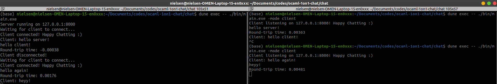

# Ocaml 1-on-1 chat

Simple one on one chat.

Application starts in two modes:

    as a server, waiting for one client to connect or
    as a client, taking an IP address (or hostname) of server to connect to

After connection is established, user on either side (server and client) can send messages to the other side. After connection is terminated by the client, server continues waiting for another client. The receiving side acknowledges every incoming message (automatically send back "message received" indication), sending side should show the roundtrip time for acknowledgment.

## How to run
To build the project, go inside `chat` directory and run `dune build`. Then, to run the application as a server/client, run `dune exec -- ./bin/main.exe -mode server -host 127.0.0.1 -port 8000`. 

Flags to be set :
* -host 127.0.0.1 "Hostname to connect/listen: default 127.0.0.1"
* -port 8000 "Port number to connect/listen: default 8000"
* -mode client/server "Start as client/server: default server"

## Example run
